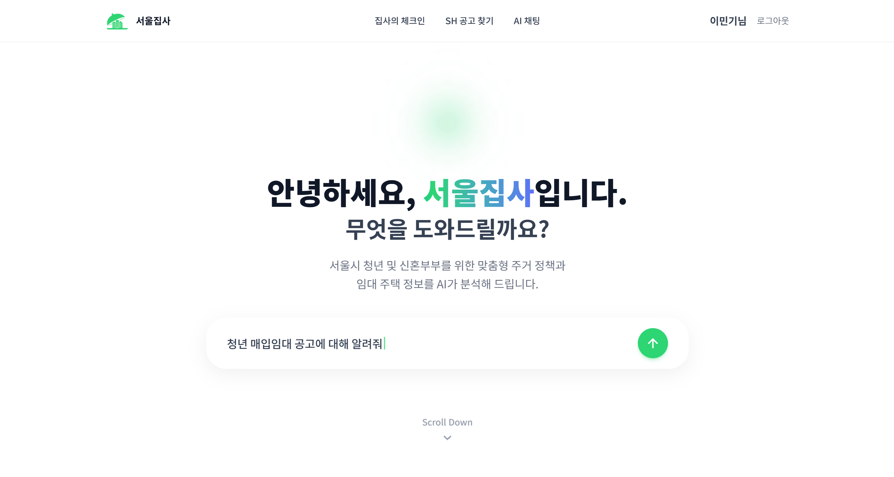
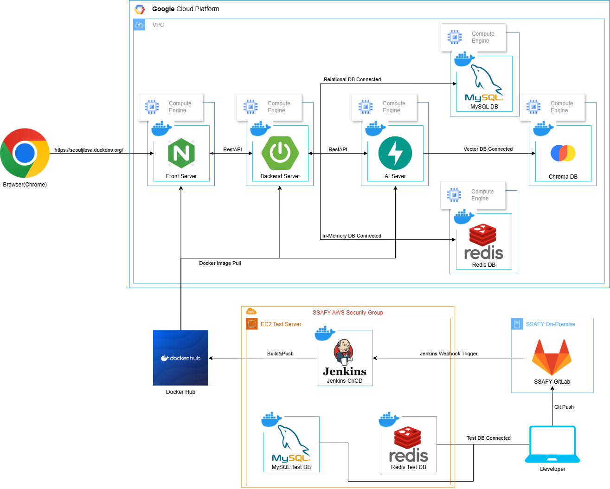
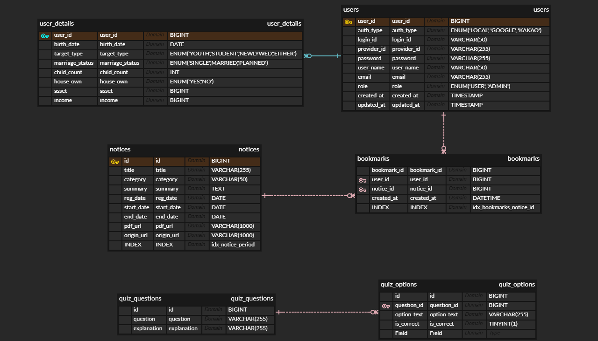

# 서울집사(Seoul Jibsa) 

**서울집사**(26.01.05 ~ 26.02.10)는 서울시 주거 지원 정책과 SH 공고를 한 곳에서 탐색할 수 있도록 돕는 **AI 챗봇 기반 서비스**입니다.  
사용자는 복잡한 공고 PDF를 일일이 읽지 않아도, 질문만으로 **자격 요건·신청 방법·필요 서류·일정**을 빠르게 확인할 수 있습니다.  
또한 서울시 지원 사업 정보까지 함께 제공해, 공고와 혜택을 **상황에 맞게 연결**해 줍니다.

## 🛠 Tech Stack (Program Source)

### Frontend

### Backend

### Database

### Server

---

## 📜 Git Convention

### Commit Message Tags
| 태그 (Tag) | 설명 (Description) | 사용 예시 (Example) |
|:---:|:---|:---|
| **Feat** | 새로운 기능을 추가할 때 (가장 많이 사용) | `Feat: 로그인 API 구현`, `Feat: 메인 페이지 버튼 추가` |
| **Fix** | 버그를 수정할 때 | `Fix: 로그인 NullPointerException 해결`, `Fix: 오타 수정` |
| **Docs** | 문서(README 등)만 수정했을 때 | `Docs: README에 실행 방법 추가`, `Docs: API 문서 업데이트` |
| **Chore** | 빌드 설정, 패키지 매니저 설정 등 (코드 로직 X) | `Chore: build.gradle 의존성 추가`, `Chore: .gitignore 수정` |
| **Refactor** | 기능 변경 없이 코드 구조만 개선했을 때 | `Refactor: 중복 코드 제거`, `Refactor: 변수명 변경` |
| **Style** | 코드 포맷팅, 세미콜론 누락 등 (코드 로직 X) | `Style: 코드 줄바꿈 정리`, `Style: 불필요한 공백 제거` |
| **Test** | 테스트 코드 추가/수정 (실제 코드 변경 X) | `Test: 회원가입 서비스 테스트 코드 작성` |

### 규칙 (Rules)
* **Merge Rule**: PM제외 Develop에 자체 Merge 금지 / 같은 팀 또는 PM이 Merge

### Git Strategy
* **Git Flow 방식 사용**
  * `main`
  * `hotfix`
  * `develop`
  * `feature`

## 💡 주요 기능

| 기능                      | 내용                                                                                                                                |
| :------------------------ | :---------------------------------------------------------------------------------------------------------------------------------- |
| **메인 챗봇**                   | 서울시 주거 지원 정책과 청약 관련 용어를 자연어로 질문하면, 핵심 개념을 쉽게 풀어 설명하고 필요한 정보를 빠르게 안내합니다. |
| **상세 조회(PDF 핵심 요약)**               | 선택한 SH/서울시 공고 PDF를 자동으로 요약해 **자격 요건·신청 일정·절차·제출 서류** 등 사용자가 꼭 봐야 할 내용을 한눈에 확인할 수 있습니다.    |
| **SH공고 전용 챗봇(공고 기반 질의응답)** | 특정 공고(PDF) 내용을 기반으로 사용자가 추가 질문을 하면, 해당 문서 맥락에 맞춰 답변해 공고 이해와 의사결정을 돕습니다.                  |
| **주거 용어 퀴즈**   | 공고에서 자주 등장하는 용어를 퀴즈 형태로 학습하여, 사용자가 공고를 스스로 읽고 이해할 수 있는 역량을 키워줍니다.            |
| **성향 테스트 기반 추천 공고 유형**            | 사용자의 상황/선호(예: 거주 형태, 우선순위, 생활 패턴 등)를 성향 테스트로 파악해, **추천 공고 유형**을 제시합니다.                                       |

 

## 📂 프로젝트 구성도

|                                   아키텍처(Architecture)                                   |
| :----------------------------------------------------------------------------------------: |
|  |

|                              개체-관계 모델(ERD)                               |
| :----------------------------------------------------------------------------: |
|  |

 

## 🎥 소개 영상

<video src="Docs/videos/intro.mp4" controls width="800"></video>

## 👪 팀원 소개

<table>
  <tr>
    <td align="center" width="150px">
      
    </td>
    <td align="center" width="150px">
      
    </td>
    <td align="center" width="150px">
      
    </td>
    <td align="center" width="150px">
      
    </td>
    <td align="center" width="150px">
      
    </td>
    <td align="center" width="150px">
      
    </td>
  </tr>
  <tr>
    <td align="center">
      <a href="https://github.com/Jo-wonbin" target="_blank">
        이민기 (AI, Infra & 팀장)
      </a>
    </td>
    <td align="center">
      <a href="https://github.com/dudqo225" target="_blank">
        박서영 (Back-end)
      </a>
    </td>
    <td align="center">
      <a href="https://github.com/yundda" target="_blank">
        윤다선 (Back-end)
      </a>
    </td>
    <td align="center">
      <a href="https://github.com/JeongHwan-dev" target="_blank">
        전기정 (AI, Back-end)
      </a>
    </td>
    <td align="center">
      <a href="https://github.com/sojjeong" target="_blank">
        조원혁 (Front-end)
      </a>
    </td>
    <td align="center">
      <a href="https://github.com/limejin">
        홍지운 (Front-end)
      </a>
    </td>
  </tr>
</table>

 

 

|  이름  |        역할        | 
개발 내용
                                                                                                                                                                                                                                                                                                                                                                                                                                                                                                                                                                                                                                                                                                                                                                                                                                                                                                                                                                                                                                                      |
| :----: | :----------------: | :--------------------------------------------------------------------------------------------------------------------------------------------------------------------------------------------------------------------------------------------------------------------------------------------------------------------------------------------------------------------------------------------------------------------------------------------------------------------------------------------------------------------------------------------------------------------------------------------------------------------------------------------------------------------------------------------------------------------------------------------------------------------------------------------------------------------------------------------------------------------------------------------------------------------------------------------------------------------------------------------------------------------------------------------------------------------------------------- |
| 이민기 | AI, Infra 팀장 | - (팀장) 프로젝트 리딩 및 일정/진행 관리 - 기획 &nbsp;&nbsp;&nbsp;&nbsp;- 프로젝트 주제 선정 &nbsp;&nbsp;&nbsp;&nbsp;- 기획안 작성 - 설계/산출물 &nbsp;&nbsp;&nbsp;&nbsp;- 요구사항 정의서 작성 &nbsp;&nbsp;&nbsp;&nbsp;- 기능 명세서 작성 &nbsp;&nbsp;&nbsp;&nbsp;- 서비스/시스템 아키텍처 구성 및 설계 &nbsp;&nbsp;&nbsp;&nbsp;- 간트 차트 페이지 생성(일정 시각화) - Infra/배포 환경 구축 &nbsp;&nbsp;&nbsp;&nbsp;- 인프라 설치 &nbsp;&nbsp;&nbsp;&nbsp;- Jenkins 배포 Pipeline 구축 - AI 개발(문서 기반 기능 준비) &nbsp;&nbsp;&nbsp;&nbsp;- 공고/정책 PDF 수집 및 임베딩용 변환 &nbsp;&nbsp;&nbsp;&nbsp;- PDF 마크다운 변환(전처리) &nbsp;&nbsp;&nbsp;&nbsp;- 종류별 상세 공고 PDF 텍스트 변환 &nbsp;&nbsp;&nbsp;&nbsp;- 종류별 주요 정책 PDF 텍스트 변환 &nbsp;&nbsp;&nbsp;&nbsp;- 청약/부동산 용어 PDF 텍스트 변환 &nbsp;&nbsp;&nbsp;&nbsp;- 챗봇 시나리오 설계                                                                                                                                                                                                                                                                                                                                                                                                                                                                                                                                                  |
| 박서영 |      Back-end      | - DB 설계 - Spring Boot로 RESTful API 작성 &nbsp;&nbsp;&nbsp;&nbsp;- 로그인 도메인 개발 &nbsp;&nbsp;&nbsp;&nbsp;- 회원가입 도메인 개발 &nbsp;&nbsp;&nbsp;&nbsp;- 아이디 찾기 도메인 개발 &nbsp;&nbsp;&nbsp;&nbsp;- 비밀번호 재설정 도메인 개발 &nbsp;&nbsp;&nbsp;&nbsp;- 회원 정보 조회 및 수정 도메인 개발 - SMTP Server, Redis를 이용한 이메일 인증 기능 구현 - 스프링 시큐리티, JWT를 이용한 인증 구현 - EC2 인프라 환경 세팅 - 프론트엔드, 백엔드 EC2 배포 - Github Action, Jenkins, Docker를 활용한 CI/CD - Letsencrypt, Certbot을 이용한 서비스 SSL 보안 적용 - Nginx 웹서버 적용(Load Balancing, Reverse Proxy, Service Redirect 설정)                                                                                                                                                                                                                                                                                                                                                                           |
| 윤다선 |      Back-end      | - DB 설계 &nbsp;&nbsp;&nbsp;&nbsp;- 기술 스택 데이터 전처리 &nbsp;&nbsp;&nbsp;&nbsp;- 교육생 인증 데이터 전처리 - 서버에 기술 스택 이미지 업로드 - Spring Boot로 RESTful API 작성 &nbsp;&nbsp;&nbsp;&nbsp;- 기술 스택 조회 서비스 도메인 개발 &nbsp;&nbsp;&nbsp;&nbsp;- 팀 생성/수정/삭제 서비스 도메인 개발 &nbsp;&nbsp;&nbsp;&nbsp;- 팀 상세보기 서비스 도메인 개발 &nbsp;&nbsp;&nbsp;&nbsp;- 팀 탈퇴 서비스 도메인 개발 &nbsp;&nbsp;&nbsp;&nbsp;- 팀 리스트 검색 서비스 도메인 개발 &nbsp;&nbsp;&nbsp;&nbsp;- 팀 합류/지원 요청 서비스 도메인 개발 &nbsp;&nbsp;&nbsp;&nbsp;- 팀 합류/지원 메세지 조회 서비스 도메인 개발 &nbsp;&nbsp;&nbsp;&nbsp;- 팀 합류/지원 요청 응답 서비스 도메인 개발 &nbsp;&nbsp;&nbsp;&nbsp;- 교육생 상세보기 서비스 도메인 개발 &nbsp;&nbsp;&nbsp;&nbsp;- 교육생 리스트 검색 서비스 도메인 개발 &nbsp;&nbsp;&nbsp;&nbsp;- 교육생 프로젝트 트랙 선택 서비스 도메인 개발 &nbsp;&nbsp;&nbsp;&nbsp;- 참여 중인 팀 조회 서비스 도메인 개발                                       |
| 전기정 |     AI, Back-end      | - '싸피 메이트' 서비스 기획 - 서비스 메인 홈 페이지 개발 - 팀 공고, 교육생 공고 정보 제공 및 검색 서비스 개발 - 팀 생성 · 수정 · 삭제 · 탈퇴 서비스 개발 - 팀 합류 요청 및 팀 지원 요청 서비스 개발 - 404 Not Found 페이지 개발 - 팀, 교육생 공고 목록 페이지, 상세 정보 페이지의 Skeleton UI 구현 - 'Redux', 'React-Query'를 이용한 상태관리 - 'Emotion'을 이용한 CSS-in-JS 방식으로 스타일링 구현  - 'Media Query'와 'React-Responsive'를 이용한 반응형 웹 구현 - 검색 엔진 최적화(SEO) 작업 &nbsp;&nbsp;&nbsp;&nbsp;- Meta Data들을 설정하고 체계화된 Heading 처리 및 시멘틱 마크업 사용, &nbsp;&nbsp;&nbsp;&nbsp;- SEO Score 100점 달성 - 웹 성능 최적화 작업 &nbsp;&nbsp;&nbsp;&nbsp;- 'Lazy Loading' 적용 &nbsp;&nbsp;&nbsp;&nbsp;- 이미지 파일 최적화 등을 통해 웹 성능 최적화 진행 &nbsp;&nbsp;&nbsp;&nbsp;- Performance Score 62점 → 88점으로 개선 &nbsp;&nbsp;&nbsp;&nbsp;- Speed Index 속도 3.5초 → 1.3초로 개선 - 'Mock Service Worker'를 이용해 목업 API 구현하여 API 테스트 진행 |
| 조원혁 |     Front-end      | - Emotion을 이용한 CSS-in-JS 방식으로 스타일링 작업 - Media Query를 이용한 반응형 UI 설계 &nbsp;&nbsp;&nbsp;&nbsp;- MUI를 이용해 모바일, 태블릿 등의 뷰포트에 따른 채팅 목록 Drawer 적용 - Custom hook을 이용한 채팅 입력 상태 관리 - Socket.io를 이용한 WebRTC 채팅 구현 &nbsp;&nbsp;&nbsp;&nbsp;- 1:1 실시간 채팅 구현, 메시지 주고 받기 &nbsp;&nbsp;&nbsp;&nbsp;- Socket의 namespace를 나누어 사용자가 타인의 채팅방에 접속하는 것 제한 &nbsp;&nbsp;&nbsp;&nbsp;- Socket으로 로그인, 로그아웃 상태를 전달해 접속 중인 사용자의 온라인 상태 동기화 - SWR을 이용한 채팅 목록, 채팅 내역 상태 관리 및 비동기 API 처리 &nbsp;&nbsp;&nbsp;&nbsp;- 채팅 내역 스크롤 이동에 따른 데이터 페이징 API 처리, 무한 스크롤링 구현 - Mock Service Worker를 이용해 목업 API 구현하여 백엔드 API 설계 이전 API 테스팅 진행                                                                                                                                                                                                                          |
| 홍지운 |     Front-end      | - 회원가입 서비스 개발 &nbsp;&nbsp;&nbsp;&nbsp;- React-hook-form 을 이용한 회원가입 form 관리 &nbsp;&nbsp;&nbsp;&nbsp;- 이메일 인증을 통한 회원가입 구현 - 로그인 &nbsp;&nbsp;&nbsp;&nbsp;- Redux, Redux Saga를 통한 회원 정보 상태 관리 - 회원 정보 수정 서비스 개발 &nbsp;&nbsp;&nbsp;&nbsp;- React custom hook 사용 &nbsp;&nbsp;&nbsp;&nbsp;- Redux, Redux-Saga를 통한 회원 정보 상태 관리 - Redux를 통한 전역 Alert 서비스 개발 - 아이디찾기, 비밀번호 재설정 서비스 개발 - 입력값에 대한 유효성 검사를 통해 불필요한 통신 최소화 - Emotion을 이용한 CSS-in-JS 방식으로 스타일링 작업 - 미디어 쿼리를 이용한 반응형 구현 - Mock Service Worker를 이용해 목업 API 구현하여 백엔드 API 설계 이전 API 테스팅 진행                                                                                                                                                                                                                                                                                                      |

 

